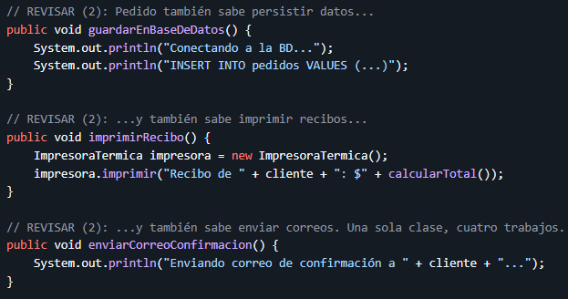

## Getting Started

En el metodo de la imagen se puede identificar una violacion al Open/Close Principle (OCP) ya que si se desea agregar un nuevo tipo de cliente, toca modificar el codigo agregando otro else if esto quiere decir que el codigo no esta cerrado violando el principio anteriormente mencionado.

Viola el Principio de Responsabilidad Única (SRP) de SOLID, el cual establece que una clase debe tener una sola razón para cambiar. Actualmente, la clase no solo gestiona los datos del pedido y calcula su total, sino que también asume la responsabilidad de persistir datos en la base de datos, imprimir recibos y enviar correos electrónicos.