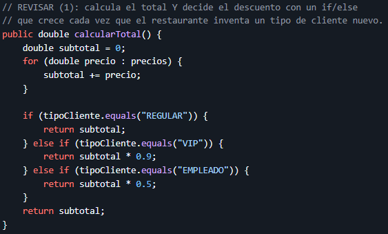

## Getting Started

En el metodo de la imagen se puede identificar una violacion al Open/Close Principle (OCP) ya que si se desea agregar un nuevo tipo de cliente, toca modificar el codigo agregando otro else if esto quiere decir que el codigo no esta cerrado violando el principio anteriormente mencionado.

